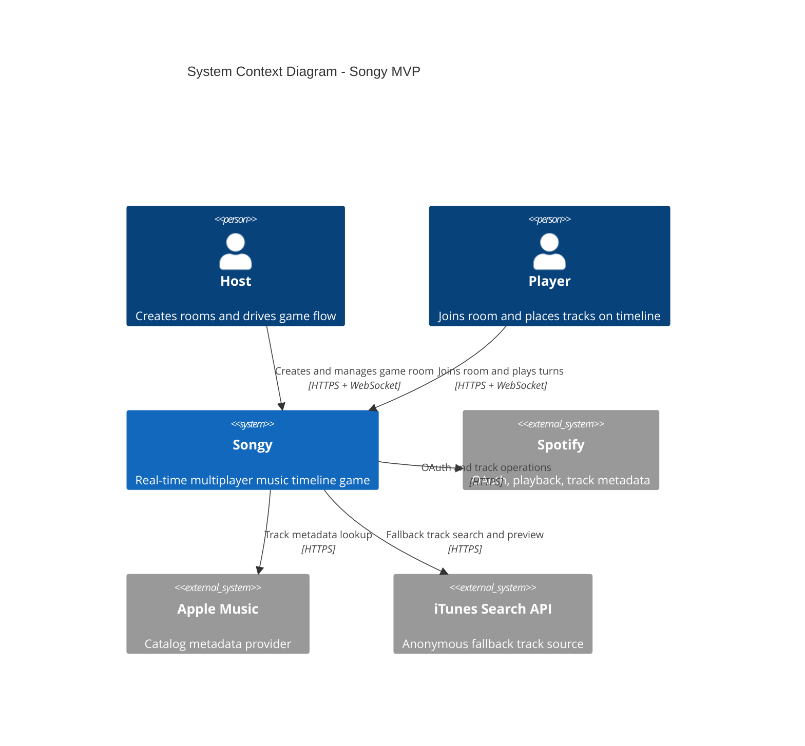
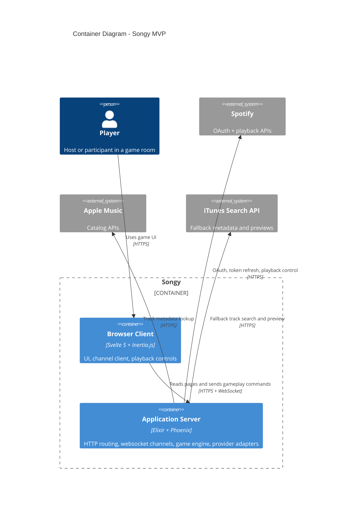
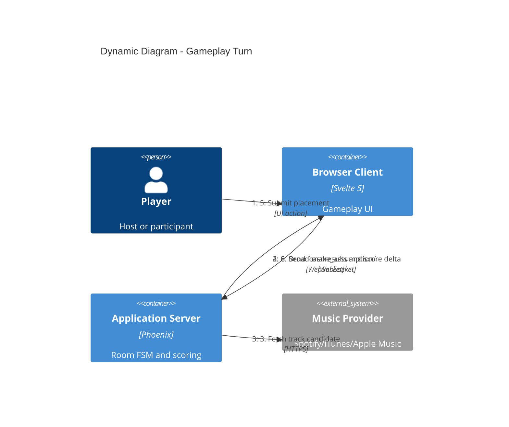
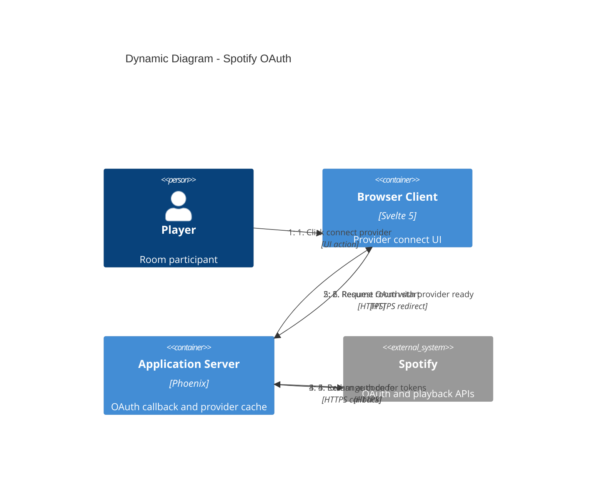
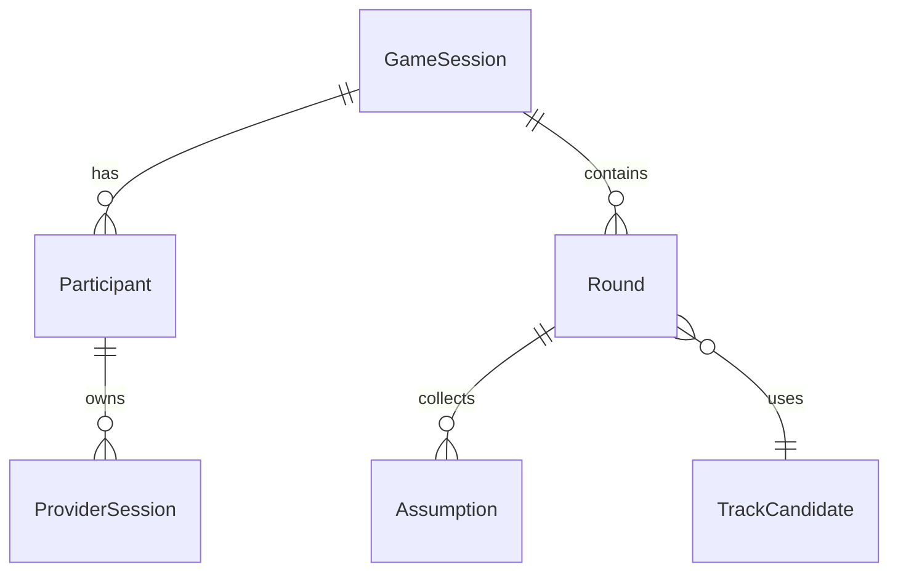
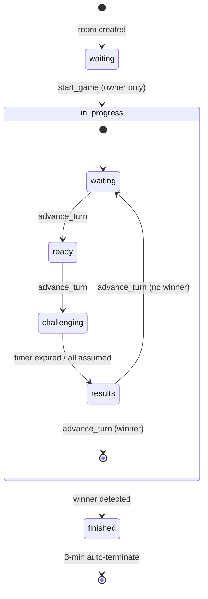

# Design Doc: Songy MVP Architecture

## Metadata

- Subject: Songy MVP architecture and technical synthesis
- Owner: Max
- Reviewers: Engineering
- Status: implemented
- Depth: standard
- Related docs:
  - Product brief: [product-brief.md](product-brief.md)
  - PRD: [prd.md](prd.md)
  - ADR links: [adr/README.md](adr/README.md)

## Summary

Songy is a real-time multiplayer timeline game built as a single Phoenix application with ephemeral room state,
channel-based synchronization, and provider abstraction for playback. The chosen architecture prioritizes fast
validation of gameplay loop and low setup friction over long-term persistence features.

## Context and scope

- Problem and why it matters: party groups abandon setup-heavy music games; Songy must prove quick room-link onboarding
  and replayable gameplay.
- Goals and non-goals: validate real-time engagement for MVP. Accounts, history, and matchmaking are explicitly out of
  scope.
- Key requirements driving this design: FR-1..FR-18 and NFR-1..NFR-8 from [PRD](prd.md).
- System context: one deployable web application integrating with external music providers.

## Architecture overview

### System context

Actors, system-of-interest, and external systems. Players interact only through the Songy web interface; provider APIs
are external dependencies.



| Requirement        | Context element or relation                                |
| ------------------ | ---------------------------------------------------------- |
| FR-1, FR-2, FR-3   | `host/player -> songy` interaction paths                   |
| FR-5, FR-15, FR-16 | `songy -> spotify/appleMusic/itunes` external integrations |
| NFR-4              | Server-side boundary in `songy` for token handling         |
| NFR-7              | `songy -> itunes` fallback relation                        |

### Main components

| Runtime component    | Technology                      | Responsibility                                                |
| -------------------- | ------------------------------- | ------------------------------------------------------------- |
| Browser client       | Svelte 5 + Inertia.js           | UI rendering, channel interaction, local playback controls    |
| Phoenix web layer    | Phoenix controllers + channels  | HTTP endpoints, websocket events, session and auth boundaries |
| Game engine          | `:gen_statem` process per room  | Room lifecycle, turn transitions, scoring, timer control      |
| Provider adapter     | Protocol-based provider modules | Track lookup and playback abstraction across providers        |
| Provider token cache | ETS                             | Server-side storage for OAuth token material                  |

### Container diagram

Runtime deployables only. In-process modules (`:gen_statem`, ETS cache, policy layer) are implementation components
of `Application Server`, not separate containers.



| Requirement       | Container element or relation                                    |
| ----------------- | ---------------------------------------------------------------- |
| FR-1, FR-2, FR-17 | `Browser Client <-> Application Server` room setup contract      |
| FR-6, FR-8        | WebSocket path between `Browser Client` and `Application Server` |
| FR-15, FR-16      | Provider relations from `Application Server` to external systems |
| NFR-2             | Real-time event propagation on WebSocket relation                |
| NFR-3             | Room fault isolation inside `Application Server` runtime model   |

## Key interactions

### Gameplay turn progression

Highest-risk flow: synchronized challenge timer, deterministic winner resolution, and provider fallback under error.



| Requirement         | Flow step                                                     |
| ------------------- | ------------------------------------------------------------- |
| FR-5                | Step 3                                                        |
| FR-6                | Steps 4 and 7                                                 |
| FR-7, FR-8, FR-9    | Steps 5 and 6                                                 |
| FR-10, FR-11, FR-12 | Step 8                                                        |
| FR-16               | Step 3 - fallback to iTunes when primary provider unavailable |
| NFR-2               | Steps 2, 4, 7, 8 latency envelope                             |
| NFR-7               | Step 3 fallback behavior                                      |

### Provider OAuth

Spotify OAuth authentication lifecycle. Token storage and fallback behavior are described in [failure contracts](#failure-contracts).



| Requirement | Flow step                            |
| ----------- | ------------------------------------ |
| FR-15       | Steps 1-6                            |
| NFR-4       | Steps 4-6 server-side token boundary |

### Room lifecycle

Create and join sequence (FR-1, FR-2, FR-3):

```text
POST /create
  -> GameSession.create_game_session(game_id, owner_id)
     -> DynamicSupervisor.start_child(GameSession)
        -> init/1 -> state = {:waiting, :none}
  -> redirect to /:room_id

GET /:room_id
  -> GameSession.get_state/1
  -> Inertia.render("room", %{room: room})

WebSocket join "room:{id}"
  -> Presence.track -> participant_joined broadcast
  -> GameSession broadcasts full state
```

Each participant joining repeats the last two steps; all connected clients receive the updated state with the new
participant.

### Track playback

Two paths depending on active provider:

- **Spotify**: server calls `PUT /v1/me/player/play` with device ID and track URI; client has Spotify Web Playback
  SDK connected via token received from `get_provider`.
- **iTunes / Apple Music**: server returns `preview_url` in track metadata; client plays via HTML5 `<audio>`.

## Domain model

### Conventions

- `required` means field must be present.
- `nullable` means field can be null.
- `fk -> Entity.field` marks reference.

### Entities

#### GameSession

| Field         | Type                       | Constraints                                            | Notes                                                        |
| ------------- | -------------------------- | ------------------------------------------------------ | ------------------------------------------------------------ |
| id            | UUID                       | required, unique                                       | Room identifier                                              |
| owner_id      | UUID                       | required, fk -> Participant.id                         | Room host                                                    |
| status        | enum                       | required, enum(waiting,in_progress,finished)           | Game lifecycle state                                         |
| phase         | enum                       | required, enum(none,waiting,ready,challenging,results) | Turn phase inside status                                     |
| queue         | UUID[]                     | required                                               | Ordered participant turn queue                               |
| cursor        | integer                    | required, default 0                                    | Active participant index                                     |
| configuration | object                     | required                                               | max_score, challenge_timeout, genre_filter, max_participants |
| scores        | map<UUID, integer>         | required                                               | Score by participant                                         |
| timelines     | map<UUID, TimelineEntry[]> | required                                               | Ordered timeline per participant                             |
| current_round | Round                      | nullable                                               | Present only while game in progress                          |

#### Participant

| Field        | Type    | Constraints            | Notes                             |
| ------------ | ------- | ---------------------- | --------------------------------- |
| id           | UUID    | required, unique       | Ephemeral identity key            |
| display_name | string  | required               | Generated at first visit          |
| avatar       | string  | required               | Avatar token or URL               |
| connected    | boolean | required, default true | Presence-derived connection state |

#### Round

| Field       | Type                  | Constraints                    | Notes                            |
| ----------- | --------------------- | ------------------------------ | -------------------------------- |
| track       | TrackCandidate        | required                       | Current track for placement      |
| assumptions | map<UUID, Assumption> | required                       | Latest placement per participant |
| winner_id   | UUID                  | nullable, fk -> Participant.id | Set at reveal phase              |
| started_at  | datetime              | required                       | Turn start timestamp             |
| ended_at    | datetime              | nullable                       | Set when round resolves          |

#### Assumption

| Field          | Type     | Constraints                    | Notes                     |
| -------------- | -------- | ------------------------------ | ------------------------- |
| participant_id | UUID     | required, fk -> Participant.id | Assumption owner          |
| position       | integer  | required, min 0                | Proposed timeline index   |
| submitted_at   | datetime | required                       | Last submission timestamp |

#### TrackCandidate

| Field        | Type    | Constraints                                | Notes                             |
| ------------ | ------- | ------------------------------------------ | --------------------------------- |
| provider     | enum    | required, enum(spotify,itunes,apple_music) | Source provider                   |
| external_id  | string  | required                                   | Provider-specific ID              |
| title        | string  | required                                   | Track title                       |
| artist       | string  | required                                   | Track artist                      |
| release_year | integer | required                                   | Canonical placement signal        |
| preview_url  | string  | nullable                                   | Direct preview URL when available |

#### ProviderSession

| Field         | Type     | Constraints                         | Notes                           |
| ------------- | -------- | ----------------------------------- | ------------------------------- |
| user_id       | UUID     | required, fk -> Participant.id      | Token owner                     |
| provider      | enum     | required, enum(spotify,apple_music) | OAuth provider                  |
| access_token  | string   | required                            | Runtime token, server-side only |
| refresh_token | string   | nullable                            | Required for refresh flow       |
| expires_at    | datetime | required                            | Token expiry timestamp          |

### Relationships



### Invariants

- `GameSession.phase` must be `none` when `GameSession.status` is `waiting` or `finished`.
- Exactly one participant is active at a time and equals `queue[cursor]`.
- `cursor` must always reference an existing participant in queue when status is `in_progress`.
- Each participant must have at most one effective assumption per round.
- Winning condition must be evaluated only in `results` phase after scoring completes.
- Provider access tokens must never be emitted in persisted client state.

## Contracts and consistency

### Boundary contract matrix

| Boundary                    | Interface type  | Owner               | Consumers                      | Contract scope                        | Status   |
| --------------------------- | --------------- | ------------------- | ------------------------------ | ------------------------------------- | -------- |
| Browser <-> Phoenix HTTP    | API             | Songy web layer     | Browser client                 | room lifecycle and OAuth entry points | verified |
| Browser <-> RoomChannel     | Async websocket | Songy channel layer | Browser client                 | state sync and gameplay commands      | verified |
| Phoenix <-> Music providers | External API    | Provider adapter    | Spotify/iTunes/Apple endpoints | track lookup and playback control     | assumed  |

### API contracts

#### HTTP endpoints

| Method   | Path                       | Purpose                          | Status   |
| -------- | -------------------------- | -------------------------------- | -------- |
| `GET`    | `/`                        | Landing page                     | verified |
| `GET`    | `/create`                  | Create game form                 | verified |
| `POST`   | `/create`                  | Create game session, redirect    | verified |
| `GET`    | `/:room_id`                | Join existing game room          | verified |
| `GET`    | `/auth/spotify/`           | Redirect to Spotify OAuth        | verified |
| `GET`    | `/auth/spotify/callback`   | OAuth code exchange              | verified |
| `DELETE` | `/auth/spotify/disconnect` | Remove Spotify provider          | verified |

#### WebSocket channel (`room:{game_id}`)

Client to server:

| Event             | Payload                | Description                               |
| ----------------- | ---------------------- | ----------------------------------------- |
| `start_game`      | `{}`                   | Owner starts the game                     |
| `advance_turn`    | `{}`                   | Advance to next phase or turn             |
| `make_assumption` | `%{"position" => int}` | Place track on timeline                   |
| `start_playback`  | `{}`                   | Start audio playback                      |
| `pause_playback`  | `{}`                   | Pause audio playback                      |
| `get_provider`    | `{}`                   | Returns `%{token: token}` for Spotify SDK |
| `update_provider` | `%{...}`               | Update provider credentials               |
| `get_current_user`| `{}`                   | Returns current User struct               |

Server to client:

| Event   | Payload                                 | Trigger                                 |
| ------- | --------------------------------------- | --------------------------------------- |
| `state` | `%{game: Game.t(), permissions: map()}` | After every state mutation              |
| `timer` | `%{remaining: integer}`                 | During challenging phase (every second) |

Presence events: `participant_joined` on join, `participant_left` on disconnect.

### Async contracts

| Stream/topic                     | Producer -> consumer          | Purpose                                | Guarantees                              | Status   |
| -------------------------------- | ----------------------------- | -------------------------------------- | --------------------------------------- | -------- |
| `room:{id}` channel command flow | Browser client -> game engine | Mutate game state via approved actions | At-most-once command handling per event | verified |
| `room:{id}` state updates        | game engine -> Browser client | Broadcast authoritative room snapshots | Eventual convergence to latest state    | verified |
| `room:{id}` timer ticks          | game engine -> Browser client | UI countdown for challenge phase       | One-second cadence while challenging    | verified |

### State contracts

Compound FSM state `{status, phase}` governs all allowed transitions.



Action gates:

- `start_game`: owner only, from `{waiting, none}`
- `advance_turn`: active player or owner, phase-dependent
- `make_assumption`: active player in `ready`, challengers in `challenging`

### Consistency rules

- Source of truth for gameplay is in-memory `GameSession` process state.
- Player queue and participant maps must be updated atomically per command.
- Timeline insertion must preserve ascending release year order.
- Score mutation and winner evaluation execute in single transition step.

### Persistence contracts

- No game-state persistence in MVP by design.
- Provider tokens live in ETS with expiry-driven refresh.
- Session identity persists in signed cookie only for browser session duration.

### Failure contracts

- Provider lookup timeout: retry once, then fallback to iTunes.
- Channel disconnect: participant marked disconnected, room process remains active.
- Room process crash: supervised restart with state loss accepted for MVP.
- OAuth refresh failure: mark provider unavailable and degrade to iTunes.

### Verification

- Unit tests validate scoring, ordering, and policy rules.
- Integration tests validate channel action gates and FSM transitions.
- E2E validates room creation to game finish flow on browser path.
- Runtime metrics validate timer cadence and fallback invocation rates.

## Migration and compatibility

This is MVP-first architecture with no legacy consumer contracts. Compatibility risk exists only for provider
integration changes.

### Change inventory

| Change                                 | Breaking | Affected consumers            | Mitigation                                          | Status   |
| -------------------------------------- | -------- | ----------------------------- | --------------------------------------------------- | -------- |
| Introduce persisted accounts after MVP | yes      | Browser session and auth flow | Add additive auth path behind feature flag          | deferred |
| Switch default provider strategy       | no       | Gameplay track sourcing       | Keep provider abstraction and fallback order config | planned  |

### Rollout strategy

1. Start with iTunes-default path for all rooms.
2. Enable Spotify OAuth path for controlled alpha cohort.
3. Expand provider options only after telemetry confirms stability.

### Rollback strategy

- Trigger conditions: provider incident rate above threshold, severe room-start failure spike.
- Fast rollback path: disable provider-specific path flags and serve iTunes-only mode.
- Data rollback needs: none for game-state, clear affected ETS token entries.
- Owner: Max.

### Exit criteria

- Alpha and beta cohorts complete full matches without critical gameplay regressions.
- Core contract boundaries have passing integration coverage.
- Fallback path success remains above agreed launch threshold.

## Alternatives considered and prior art

- Option A - Elixir/Phoenix + in-memory per-room state (chosen)
  - Pros: native process isolation, simple real-time model, fast iteration
  - Cons: transient state, single-node operational ceiling in MVP
- Option B - Node.js + real-time framework
  - Pros: larger ecosystem and hiring pool
  - Cons: weaker native isolation semantics and supervision
- Option C - DB-backed authoritative state from day one
  - Pros: persistence and analytics readiness
  - Cons: slower MVP delivery and larger migration surface
- Prior art: timeline board games validate social mechanic; party quiz apps validate room-link onboarding but not
  timeline strategy depth.
- Chosen option and why: Option A best matches MVP risk profile and reversibility goals.

## Cross-cutting concerns

### Security

#### Session management

Cookie-based sessions (`_songy_key`): Same-Site Lax, HttpOnly, Secure (production), Max-Age 24h, signed and encrypted.

#### Authentication

- **Ephemeral identity** ([ADR-006](adr/006-ephemeral-identities.md)): first visit generates UUID + random name +
  avatar, stored in cookie, no persistence.
- **WebSocket token**: server signs `user.uuid` via `Phoenix.Token`, client sends on socket connect, server verifies
  in `UserSocket.connect/3`.
- **Spotify OAuth**: server exchanges code for tokens, stores in ETS ([ADR-007](adr/007-token-storage-ets.md)),
  auto-refreshes when within 3600s of expiry. Scopes: `user-read-playback-state`, `user-modify-playback-state`,
  `streaming`, `user-read-email`, `user-read-private`.
- **Apple Music**: `APPLE_MUSIC_ACCESS_TOKEN` env var, no user-level OAuth.
- **iTunes**: public API, no auth.

#### CSRF

`protect_from_forgery` and `put_secure_browser_headers` plugs on all browser pipelines.

#### Authorization

Role-based via `Songy.Policy` (Bodyguard):

| Role          | Determination                                                 |
| ------------- | ------------------------------------------------------------- |
| `:owner`      | `user_id == game.owner_id`                                    |
| `:player`     | `user_id == Enum.at(game.queue, game.cursor)` (active player) |
| `:challenger` | Any participant not currently the active player               |

| Action             | Allowed roles                                   | Required state      |
| ------------------ | ----------------------------------------------- | ------------------- |
| `start_game`       | owner                                           | `{:waiting, :none}` |
| `advance_turn`     | player, owner                                   | varies by phase     |
| `make_assumption`  | player (`:ready`), challenger (`:challenging`)  | in_progress         |
| `control_playback` | player, owner, challenger (`:challenging` only) | in_progress         |
| `see_assumptions`  | any                                             | `:results` phase    |

#### Provider token boundaries

Spotify tokens live in ETS only, never in cookies or client state. Client receives the access token solely via
`get_provider` channel event for the Web Playback SDK. Invalid or expired provider falls back to iTunes.

#### Threat model

| Threat                    | Mitigation                            |
| ------------------------- | ------------------------------------- |
| Session hijacking         | HttpOnly + Secure + SameSite cookies  |
| CSRF                      | Phoenix CSRF protection               |
| WebSocket spoofing        | Signed user token verification        |
| Token leakage             | ETS server-side only, never persisted |
| Unauthorized game actions | Role-based policy checks per action   |

### Deployment

Environment variables required in production:

| Variable                   | Purpose                            |
| -------------------------- | ---------------------------------- |
| `SECRET_KEY_BASE`          | Session encryption (min 64 bytes)  |
| `PHX_HOST`                 | Hostname for URL generation        |
| `PORT`                     | HTTP listener port                 |
| `PHX_URL_SCHEME`           | `https` for production             |
| `PHX_URL_PORT`             | Public-facing port (443 for HTTPS) |
| `DNS_CLUSTER_QUERY`        | DNS-based clustering (optional)    |
| `SPOTIFY_CLIENT_ID`        | Spotify OAuth                      |
| `SPOTIFY_SECRET_KEY`       | Spotify OAuth                      |
| `APPLE_MUSIC_ACCESS_TOKEN` | Apple Music API                    |

Runtime: Bandit HTTP adapter, `Phoenix.PubSub` local, no database. Build: `MIX_ENV=prod mix release`.

Operational notes:

- Game processes auto-terminate 3 minutes after finishing.
- `DynamicSupervisor` restarts crashed game processes; state is lost on crash (accepted for MVP).
- ETS provider cache is reconstructed on application start; affected users fall back to iTunes.
- No persistent state to back up or migrate.

Scaling strategy: single BEAM node, vertical scaling before horizontal ([ADR-008](adr/008-scaling-single-node-sticky-sessions.md)).

### Other concerns

- Privacy: no persistent personal profile or user-generated content in MVP.
- Observability: emit room lifecycle and turn resolution events with baseline alerting.
- Failure modes and degradation: provider fallback and room isolation limit blast radius.

## Test strategy

- Unit and integration boundaries:
  - unit: scoring rules, ordering validators, provider adapters
  - integration: channel event handling, policy gates, FSM transitions
- What cannot be tested automatically:
  - subjective gameplay fun and frustration thresholds
  - real-world provider regional content variance
- Load or stress testing needs:
  - room concurrency and broadcast latency under peak participant counts

## Open questions

| Question                                                                | Owner | Next step                                    | Deadline   | Status |
| ----------------------------------------------------------------------- | ----- | -------------------------------------------- | ---------- | ------ |
| What telemetry thresholds should gate open beta?                        | Max   | Define launch dashboard and alert thresholds | 2026-03-20 | open   |
| When does single-node model become unacceptable for target concurrency? | Max   | Run load profile and set scaling trigger     | 2026-03-24 | open   |
| Should fairness model adjust for late-join participants?                | Max   | Validate with session replay analysis        | 2026-03-30 | open   |

## Decision log and ADRs

| Decision                                     | Rationale                                                  | ADR link                                                  |
| -------------------------------------------- | ---------------------------------------------------------- | --------------------------------------------------------- |
| Use Elixir/Phoenix runtime                   | Fits concurrent stateful room model with process isolation | [ADR-001](adr/001-elixir-phoenix-runtime.md)              |
| Model room lifecycle with `:gen_statem`      | Deterministic phase transitions and timer orchestration    | [ADR-002](adr/002-in-memory-state-genstatem.md)           |
| Use Phoenix Channels for room sync           | Native real-time transport with presence support           | [ADR-003](adr/003-phoenix-channels-realtime.md)           |
| Keep provider abstraction and fallback chain | Decouple gameplay from single provider risk                | [ADR-004](adr/004-provider-abstraction.md)                |
| Keep identities ephemeral in MVP             | Reduce onboarding friction and implementation scope        | [ADR-006](adr/006-ephemeral-identities.md)                |
| Store provider tokens in ETS                 | Keep tokens server-side with low-latency access            | [ADR-007](adr/007-token-storage-ets.md)                   |
| Start with single-node scaling strategy      | Matches MVP traffic assumptions and delivery speed         | [ADR-008](adr/008-scaling-single-node-sticky-sessions.md) |
